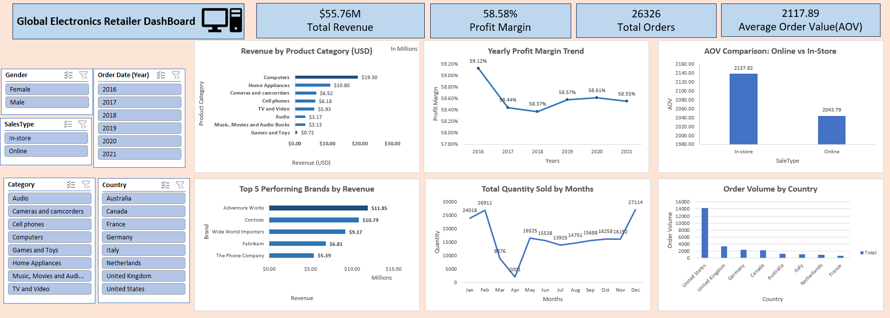

# 📊 Global Electronics Retailer Analysis

## 📌 Project Overview
This project analyzes sales performance of a global electronics retailer using Excel, Power Pivot, and DAX.

The dashboard provides insights into:
- Revenue performance
- Profit margin trends
- Product category analysis
- Brand performance
- Geographic distribution
- SalesType comparison (Online vs In-store)
- Seasonal sales patterns

---

## 📈 Key KPIs
- Total Revenue: $55.76M
- Profit Margin: 58.58%
- Total Orders: 26,326
- Average Order Value (AOV): $2,117.89

---

## 📊 Dashboard Preview

---

## 🛠 Tools Used
- Microsoft Excel
- Power Query
- Power Pivot
- DAX
- Pivot Tables
- Data Modeling (Star Schema)

---

## 🧠 Key Insights
- Computers generate the highest revenue.
- In-store AOV is slightly higher than online.
- Profit margins remain stable (~58%) across years.
- Sales peak in December indicating strong seasonality.
- United States leads in order volume.

---

## 📂 Dataset
The dataset includes:
- Customers
- Products
- Sales
- Stores
- Data_Dictionary

---

## 🚀 Author
Raunak Gangwal
